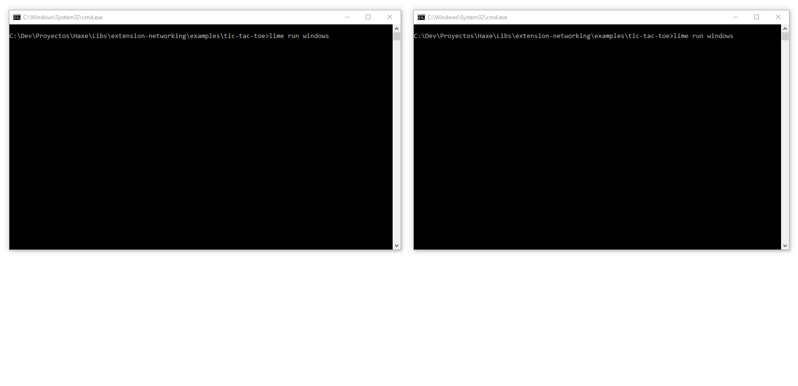

# Tic-tac-toe

## Description

This example is an implementation of the well known [Tic-tac-toe](https://en.wikipedia.org/wiki/Tic-tac-toe) game, using this networking library.



## Directory tree

This is the directory tree structure:

````
basic-example
  |- assets              # Assets folder (images and icons). Not important.
  |- dev                 # Assets source files. Not important.
  |- src                 # Haxe code folder.
  |  |- Board.hx         # Class that represents the board.
  |  |- Game.hx          # Class that represents a game session.
  |  |- Main.hx          # Main code content wrapper.
  |  |- Menu.hx          # Class that represents the main menu.
  |  |- Piece.hx         # Class that represents a single piece (X or O).
  |  |- StatusMessage.hx # Class that handles a screen message text.
  |- preview.gif         # Example GIF.
  |- project.xml         # OpenFL XML project file.
  |- README.md           # This file.
````

The networking content is inside the [src/Game.hx](src/Game.hx) file. It is well documented, so you can ignore everything else and focus on that file.

## Usage

Open a terminal within the example folder, and run:

````sh
$ openfl build <linux|windows|...>
````

After that, you can run it with:

````sh
$ openfl run <linux|windows|...>
````

Run it twice in two different terminals; create a server and a client, click the screen on any window, and check the output!


## TODO

- Add a textfield to select a host and a port to connect to.
- Add a button to restart finished games.
